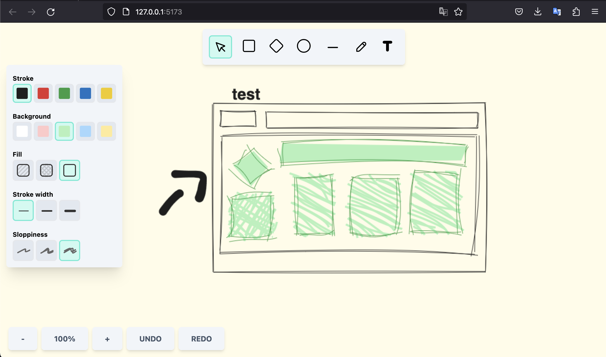

# whiteboard

<!-- Title -->

  

  <b>Whiteboard implementation using React.js (excalidraw clone)</b>
   

<!-- Body -->

### Getting Started

To see this on your machine, just run:

- `yarn dev: ` will start a React web-app on [localhost:5173](http://localhost:5173/)

### Features

- Elements with different shapes (toolbox)
- Update element position / size and change background / stroke colors
- undo / redo actions on the scene
- zoom / pan actions on the scene
- Freehand and Text element tools

## Built With

- [Vite](https://vitejs.dev/) - Next Generation Frontend Tooling
- [React.js](https://react.dev/)  - The library for web and native user interfaces
- [Roughjs](https://roughjs.com/) - Create graphics with a hand-drawn, sketchy, appearance

## Acknowledgments

- [redhwannacef](https://github.com/redhwannacef) - Thanks for his drawing app tutorial series, this project is totally based on his tutorial, with one or more modifications in order to learn about it.
